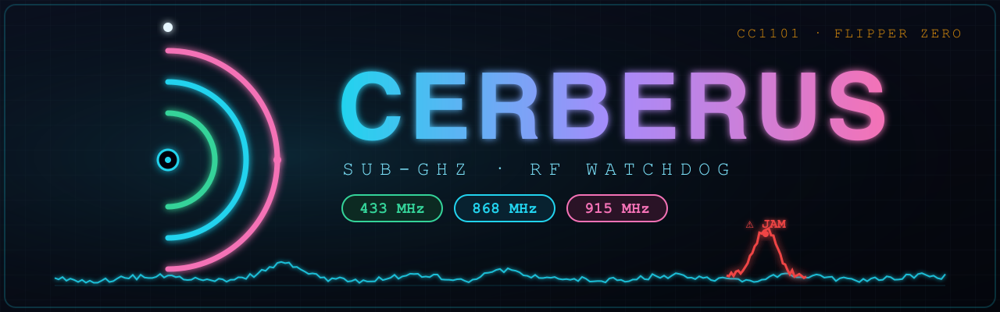
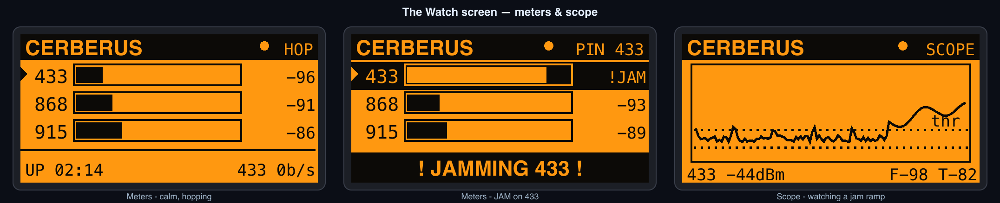

<div align="center">



# Cerberus 🐺🐺🐺

### A passive Sub‑GHz RF watchdog for the Flipper Zero

*Three heads, three bands. Cerberus sits quietly in your space and watches the
**433 / 868 / 915 MHz** ISM bands — barking the instant it sees **jamming**,
a **signal flood**, or a **replayed capture** aimed at your own garage, car,
alarm or sensors.*


</div>

---

## 🩻 What it is

Most Sub-GHz tools are made to **transmit**. Cerberus does the opposite — it is
a **receive-only sentry**. Drop it on a desk in the space you want to protect
and it continuously samples the RF energy on the three bands your wireless
remotes, key fobs, alarm sensors and meters most likely live on. When the
airwaves start behaving like an attack, it lights up, buzzes, sounds off and
logs exactly what it saw.

It is built for the people who already carry a Flipper: hackers, pentesters,
ham/RF tinkerers and the security-curious who want to **know when someone is
messing with their own radio space**.

> Cerberus **never transmits.** It only listens. See [Legal & ethics](#-legal--ethics).

<div align="center">

</div>

---

## ✨ Features

- **🐺 Three-headed watch** — monitors 433.92, 868.35 and 915.00 MHz, either
  band-hopping across all three or pinned to one for maximum vigilance.
- **🚨 Three threat detectors**
  - **Jamming** — the channel is held continuously busy (energy that never
    falls back to the noise floor) beyond a dwell time.
  - **Flood** — an abnormal storm of short transmissions per second.
  - **Replay / repeat** — the same burst *fingerprint* repeating far more often
    than legitimate traffic, the tell-tale of a captured-and-replayed or
    brute-forced remote.
- **📈 Beautiful live UI** — a clean signal meter for each band, an active-head
  indicator, peak-hold, live burst rate, uptime, and a flashing alert banner
  that names the threat and the band.
- **🩻 Scope view** — flip to a scrolling oscilloscope (◄/►) that graphs a band's
  RSSI over time against its live **noise-floor** and **detection-threshold**
  lines, so you can *watch* an attack build. Pick the band with ▲/▼.
- **📊 Stats dashboard** — totals, per-threat (jam/flood/replay) and per-band
  breakdowns, live noise floors and uptime, with a one-press reset.
- **🗒️ SD card logging** — optionally append every alert to `alerts.csv` for a
  forensic record you can pull off the card later.
- **🔕 Arm / Silent** — long-press OK to mute the alarms while it keeps detecting
  and logging; **keep-screen-on** mode turns it into a true desk sentry.
- **🧠 Self-calibrating** — an adaptive per-band noise floor means it just works
  in any RF environment. Press **OK** to recalibrate after you move it.
- **🔔 Multi-channel alerts** — LED, vibration and a custom alert tone, each
  independently toggleable.
- **📒 Alert log** — a scrollable history of every bark: time, threat, band and
  signal strength.
- **💾 Persistent settings** — your scan mode, sensitivity and toggles are saved
  to the SD card between runs.

---

## 🎮 Controls

| Key | On menus | On the **Watch** screen |
| --- | --- | --- |
| **▲ / ▼** | Move selection / scroll | **Scope:** pick the graphed band |
| **◄ / ►** | Adjust value | Toggle **Meters ↔ Scope** |
| **OK** | Open item | **Recalibrate** the noise floor |
| **Hold OK** | — | **Arm ↔ Silent** (mute the alarms) |
| **← Back** | Previous screen | Stop watching / back to menu |

When you leave the Watch screen the radio is released; open **Watch** again to
resume guarding. In **Stats**, press the **Reset** button to clear the counters,
the alert log and `alerts.csv`.

---

## ⚙️ Settings

| Setting | Options | Default | What it does |
| --- | --- | --- | --- |
| **Scan Mode** | Hop 3-band · Pin 433 · Pin 868 · Pin 915 | Hop 3-band | Watch all three bands in rotation, or camp one band. **Pin** a band for the most reliable jamming detection. |
| **Sensitivity** | Low · Medium · High | Medium | How aggressively a signal counts as activity. Higher = catches weaker/fewer signals (and more false positives). |
| **Detect Jam** | On / Off | On | Toggle the jamming detector. |
| **Detect Flood** | On / Off | On | Toggle the burst-flood detector. |
| **Detect Replay** | On / Off | On | Toggle the repeated-capture detector. |
| **Alert Sound** | On / Off | On | Play the alert tone. |
| **Alert Vibro** | On / Off | On | Buzz on alert. |
| **Alert LED** | On / Off | On | Flash the red LED on alert. |
| **Log to SD** | On / Off | Off | Append every alert to `alerts.csv` on the SD card. |
| **Keep Screen On** | On / Off | On | Hold the backlight on while the Watch screen is open. |

---

## 🧪 How the detection works

Cerberus drives the internal **CC1101** in a wide OOK receive mode and reads the
**RSSI** (signal strength, in dBm) hundreds of times per second. For each band
it maintains an **adaptive noise floor** and watches three things:

| Threat | Signature Cerberus looks for |
| --- | --- |
| **JAMMING** | Channel *occupancy* stays near 100 % — energy well above the floor that never gaps back down — for longer than the dwell time. |
| **FLOOD** | The number of distinct bursts in the last second crosses the rate threshold. |
| **REPLAY** | A coarse burst fingerprint (duration + amplitude bucket) recurs more times than normal traffic would produce. |

> **Honest about the limits.** This is an **energy/heuristic** detector, not a
> protocol decoder — it does **not** demodulate, decode or store the contents of
> any transmission. Replay detection flags *suspicious repetition*, not a
> cryptographically confirmed replay. In **Hop** mode the radio time-slices the
> three bands, so for the most reliable **jamming** detection, **pin** the band
> you care about. Tune **Sensitivity** to your environment to avoid false
> positives. PRs that add a real decoder path are very welcome — see the
> [roadmap](#-roadmap).

---

## 📲 Install on your Flipper Zero

> ℹ️ A `.fap` is tied to the firmware API it was built against. If Cerberus
> refuses to launch, it was built for a different firmware — rebuild it with
> `ufbt` matched to **your** firmware (see [Build from source](#-build-from-source)).

### Option A — Build & flash with `ufbt` (recommended)

[`ufbt`](https://github.com/flipperdevices/flipperzero-ufbt) is the micro Flipper
Build Tool — the easiest path from source to a running app.

```bash
# 1. install ufbt
python3 -m pip install --upgrade ufbt

# 2. point ufbt at your firmware channel (release / rc / dev)
ufbt update --channel=release

# 3. grab Cerberus
git clone https://github.com/at0m-b0mb/flipper-cerberus.git
cd flipper-cerberus

# 4a. just build  ->  dist/cerberus.fap
ufbt

# 4b. or build, upload to a connected Flipper over USB, and launch it
ufbt launch
```

### Option B — Drop a prebuilt `.fap` onto the SD card

1. Download `cerberus.fap` from the [**Releases**](https://github.com/at0m-b0mb/flipper-cerberus/releases) page.
2. Connect your Flipper over USB and open [**qFlipper**](https://flipperzero.one/update).
3. Copy `cerberus.fap` to the SD card under **`apps/Sub-GHz/`**
   (path on the card: `/ext/apps/Sub-GHz/cerberus.fap`).
4. On the Flipper: **Apps → Sub-GHz → Cerberus**. 🐺

### Option C — Inside a firmware source tree

Works with official, **Unleashed**, **Momentum** and **RogueMaster** trees.

```bash
# from the root of your flipperzero firmware checkout
git clone https://github.com/at0m-b0mb/flipper-cerberus.git applications_user/cerberus
./fbt fap_cerberus                                   # build the .fap
./fbt launch APPSRC=applications_user/cerberus       # build + run on device
```

---

## 🛠️ Build from source

Requirements: Python 3.8+, a USB cable, and a Flipper on current firmware.

```bash
python3 -m pip install --upgrade ufbt
ufbt update --channel=release      # or rc / dev to match your device
git clone https://github.com/at0m-b0mb/flipper-cerberus.git
cd flipper-cerberus
ufbt                               # -> dist/cerberus.fap
ufbt launch                        # flash + run
ufbt cli                           # optional: open the device CLI
```

Building for a custom firmware? Run `ufbt update` against that firmware's SDK
(`--channel`/`--index-url`/`--branch`) before `ufbt`, so the app links against
the matching API.

---

## 🗂️ Project layout

```
flipper-cerberus/
├── application.fam            # Flipper app manifest
├── cerberus.c                 # entry point, view dispatcher, alerts, config I/O
├── cerberus_i.h               # shared app state
├── scenes/                    # screen flow (scene manager)
│   ├── cerberus_scene_start.c     #   main menu
│   ├── cerberus_scene_monitor.c   #   the Watch screen (meters + scope)
│   ├── cerberus_scene_stats.c     #   stats dashboard + reset
│   ├── cerberus_scene_alerts.c    #   alert log
│   ├── cerberus_scene_settings.c  #   settings
│   └── cerberus_scene_about.c     #   about / ethics
├── views/
│   └── cerberus_monitor_view.c    # the live meter + scope UI (canvas drawing)
├── helpers/
│   ├── cerberus_subghz.c          # CC1101 RSSI worker thread + band hopping
│   └── cerberus_detector.c        # jam / flood / replay detection engine
├── images/cerberus_10px.png   # app icon
├── assets/banner.svg|png      # repo banner
└── docs/screens.svg|png       # UI mockups
```

---

## 🗺️ Roadmap

- [x] Scrolling **Scope** view — per-band RSSI vs. floor/threshold — *v1.1*
- [x] **CSV logging** of alerts to the SD card — *v1.1*
- [x] **Stats dashboard**, arm/silent mute, keep-screen-on — *v1.1*
- [ ] Full **waterfall / spectrogram** (per-frequency-bin) view
- [ ] Per-band, user-adjustable thresholds
- [ ] Optional **protocol decoder** path for confirmed rolling-code replay
- [ ] User-defined band list (beyond the default three)
- [ ] External CC1101 module support

Got an idea? Open an issue. 🐺

---

## ⚖️ Legal & ethics

Cerberus is a **defensive, receive-only** tool. It **does not transmit** anything.

- Only monitor RF in **spaces you own or are explicitly authorised to test**.
- You are responsible for complying with your local radio, wiretap and privacy
  regulations — ISM band rules differ by region.
- Don't use it to surveil people or spaces without consent.

Use it to understand and protect your own airspace. Be a good neighbour.

---

## 🤝 Contributing

Issues and PRs welcome — detection tuning, new views, decoder integration, and
firmware-compatibility fixes especially. Keep the code in the existing Flipper
style (scene manager + views, no blocking work on the GUI thread).

---

## 📜 License

[MIT](LICENSE) © [at0m-b0mb](https://github.com/at0m-b0mb)

<div align="center">
<sub>Built for the Flipper Zero community. Stay curious, stay defensive. 🐺🐺🐺</sub>
</div>
